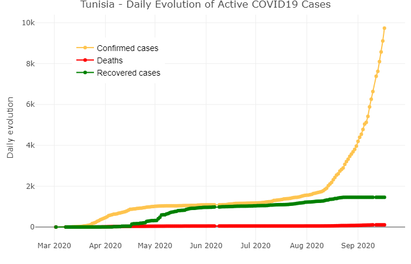
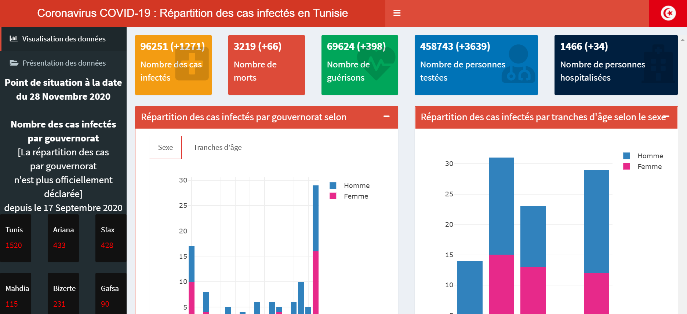

This package provides per-day data on COVID-19 cases in [Tunisia](https://en.wikipedia.org/wiki/Tunisia).

The data is an average over all of the sources provided by [Mouna Belaid](https://github.com/MounaBelaid/covid19datatunisia).


## Installation

You can install the released version of covid19tunisia with:

``` r
remotes::install_github("MounaBelaid/covid19tunisia")

```

## Usage

``` r
data <- refresh_covid19tunisia()

head(data)
#> # A tibble: 6 x 7
  date       location location_type location_code location_code_type data_type value
  <date>     <chr>    <chr>         <chr>         <chr>              <chr>     <dbl>
1 2020-03-02 Gafsa    state         TN-71         iso_3166_2         cases_new     1
2 2020-03-08 Mahdia   state         TN-53         iso_3166_2         cases_new     1
3 2020-03-09 Bizerte  state         TN-23         iso_3166_2         cases_new     1
4 2020-03-09 Mahdia   state         TN-53         iso_3166_2         cases_new     1
5 2020-03-09 Tunis    state         TN-11         iso_3166_2         cases_new     1
6 2020-03-10 Mahdia   state         TN-53         iso_3166_2         cases_new     1
```

### Plotting the daily evolution of active cases

``` r
# Transform the data

library(dplyr)
library(tidyr)
library(plotly)

data_transformed <- data %>% group_by(date,data_type) %>% summarise(value=sum(value)) %>% 
                    spread(data_type,value)

head(data_transformed)
# A tibble: 6 x 4
# Groups:   date [6]
  date       cases_new deaths_new recovered_new
  <date>         <dbl>      <dbl>         <dbl>
1 2020-03-02         1          0             0
2 2020-03-08         1          0             0
3 2020-03-09         3          0             0
4 2020-03-10         1          0             0
5 2020-03-11         1          0             0
6 2020-03-12         6          0             0

  data_transformed %>%
  ungroup() %>% plot_ly(type = 'scatter', 
                        mode = 'lines+markers')%>% 
  add_trace(x = ~date, y = ~cumsum(cases_new), 
            name = 'Confirmed cases',
            marker = list(color = '#fec44f'),
            line = list(color = '#fec44f'),
            hoverinfo = "text",
            text = ~paste(cases_new, "New confirmed cases\n",cumsum(cases_new), 'Total number of infected cases on',date)) %>%
  add_trace(x = ~date, y = ~cumsum(deaths_new),
            name = 'Deaths',
            marker = list(color = 'red'),
            line = list(color = 'red'),
            hoverinfo = "text",
            text = ~paste(deaths_new, "New deaths\n",cumsum(deaths_new), 'Total number of deaths on',date)) %>%
  add_trace(x = ~date, y = ~cumsum(recovered_new), 
            name = 'Recovered cases',
            marker = list(color = 'green'),
            line = list(color = 'green'),
            hoverinfo = "text",
            text = ~paste(recovered_new, "New recovered cases\n",cumsum(recovered_new), 'Total number of recovered cases on',date)) %>% 
  layout(title = 'Tunisia - Daily Evolution of Active COVID19 Cases',
         legend = list(x = 0.1, y = 0.9,
                       font = list(family = "sans-serif",size = 14,color = "#000"),bgcolor = "",
                       bordercolor = "#FFFFFF", borderwidth = 2),
         xaxis = list(title = ""),
         yaxis = list(side = 'left', title = 'Daily evolution', showgrid = TRUE, zeroline = TRUE))
                        
```



## Supporting Shiny Application

A supporting Shiny Application for the **covid19tunisia** dataset available
[here](https://mounabelaid.shinyapps.io/coronavirus/).


